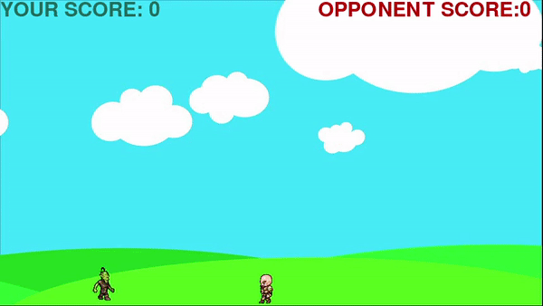

# HIT MAN

----

This game is developed using python and pygame-module.In this game there is one enemy and one hero of hit man which operates by user with the help of arrow keys hit man has an ability to move jump and fire bullets. The point or score increses if bullet hits enemy and if enemy touchs hitman or enemy  hit hitman than score of user or player decreases. Game ends when score of player became 0 you also restart game by pressing tab key.

----

   

