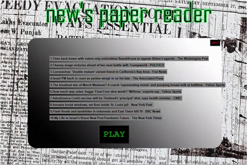

# NEWS READER 

In this project i build an program with the use of python. For gui interface tkinter module is used.The api used here is newsapi.org.

# How to run app 

 *  For run this app your have to download python in your local computer.
 * `https://www.python.org/downloads/`
 *  After installing python you have to install tkinter module
 *  For gui interface - `pip install tk`
 *  For working with images - `pip install pillow`
 *  Api that used here - `https://newsapi.org/`

# How to run modules

 * In this programm you just have to click single button.

   

